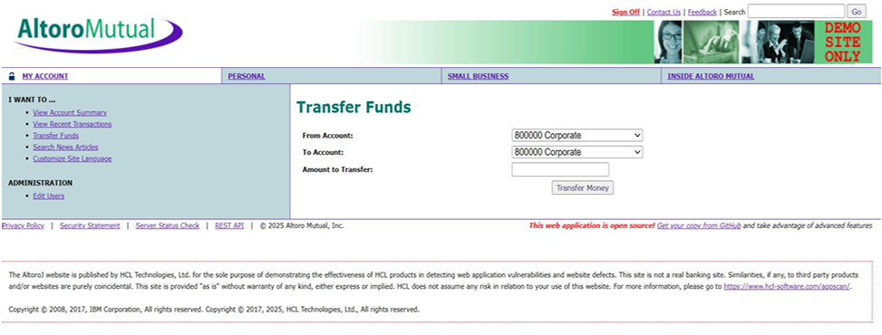
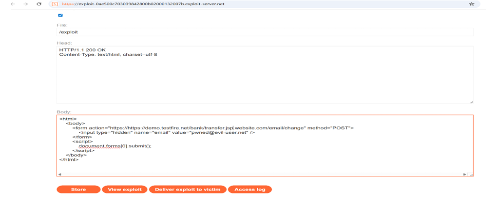
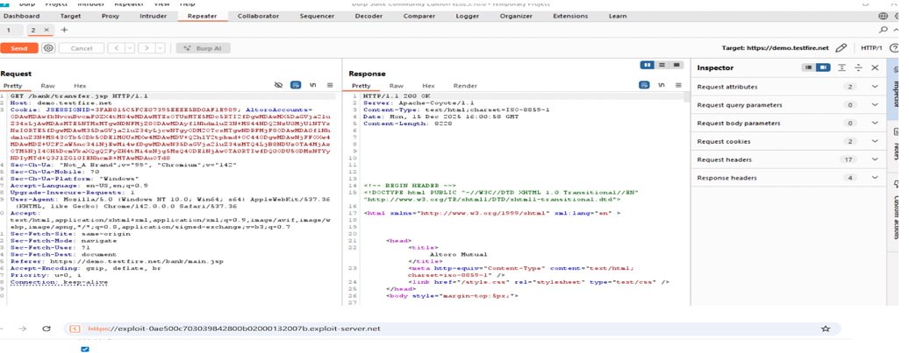
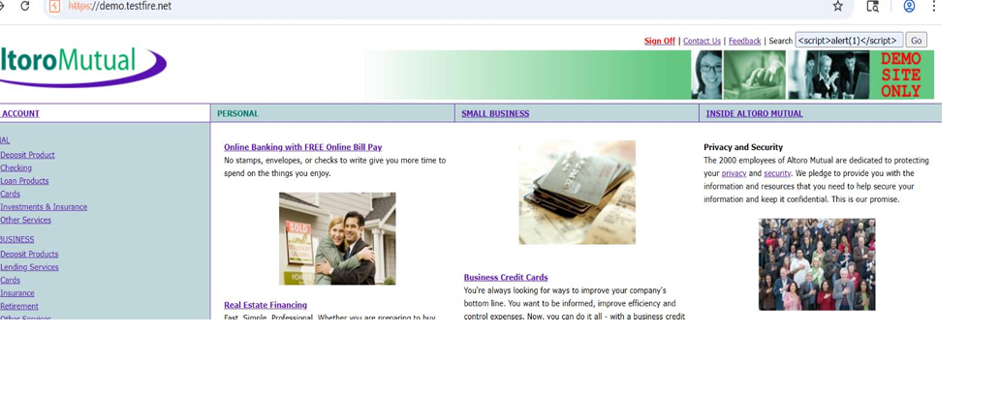
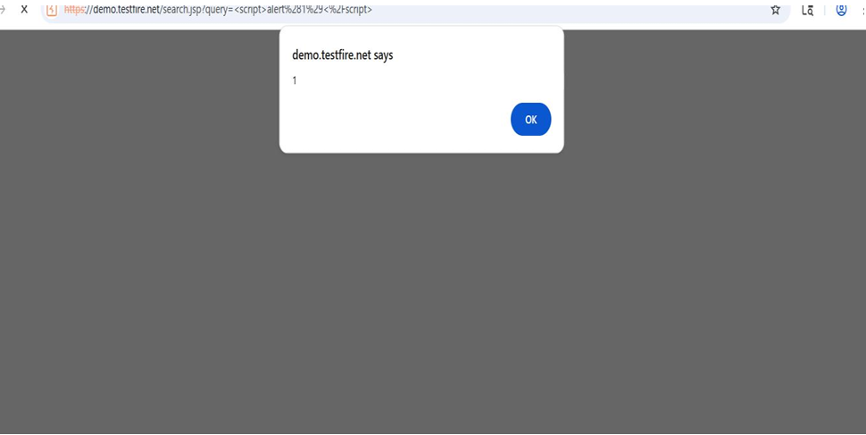

# altoro-mutual-vapt-assessment
Web application penetration testing practice on the Altoro Mutual demo banking application.
# Web Application VAPT Assessment – Altoro Mutual (demo.testfire.net)

This repository contains hands-on web application penetration testing practice performed on the Altoro Mutual demo banking application.

## Tools Used
- Burp Suite
- OWASP ZAP
- Nmap
- Kali Linux

## Activities Performed
- Web application reconnaissance and endpoint analysis
- HTTP/HTTPS request interception and manipulation
- Authentication and session management testing
- Input validation testing
- Vulnerability documentation and reporting

## Vulnerabilities Identified
- Authentication Weaknesses
- Session Management Issues
- Information Disclosure
- Input Validation Vulnerabilities
- Broken Access Control

## Methodology
Testing activities were performed following OWASP Web Security Testing Guide (OWASP WSTG) principles.

## Project Description

- Performed web application penetration testing on the Altoro Mutual demo banking application.
- Identified vulnerabilities related to authentication, session management, information disclosure, and input validation.
- Intercepted and manipulated HTTP/HTTPS requests using Burp Suite Proxy and Repeater.
- Conducted reconnaissance and endpoint analysis to identify potential attack surfaces.
- Documented findings with severity ratings and remediation recommendations aligned with OWASP WSTG methodology.

## Sample Testing Areas
- Login functionality testing
- Parameter manipulation
- Session token analysis
- Access control testing
- HTTP request modification

## Objective

To strengthen practical web application penetration testing skills through hands-on vulnerability assessment exercises in a controlled lab environment.
## VAPT Assessment Report

The complete vulnerability assessment report for the Altoro Mutual demo banking application is available below.

[Download Report](altoro-mutual-vapt-report.pdf)
## Cross-Site Request Forgery (CSRF)

The screenshot below demonstrates a Cross-Site Request Forgery (CSRF) vulnerability where the application failed to implement adequate CSRF protection mechanisms. This allowed authenticated actions to be performed without user consent.

## Reflected Cross-Site Scripting (XSS)

The screenshot below demonstrates a Reflected Cross-Site Scripting (XSS) vulnerability caused by improper sanitization and encoding of user-supplied input in the search parameter. A malicious JavaScript payload was reflected in the server response and executed in the browser.

